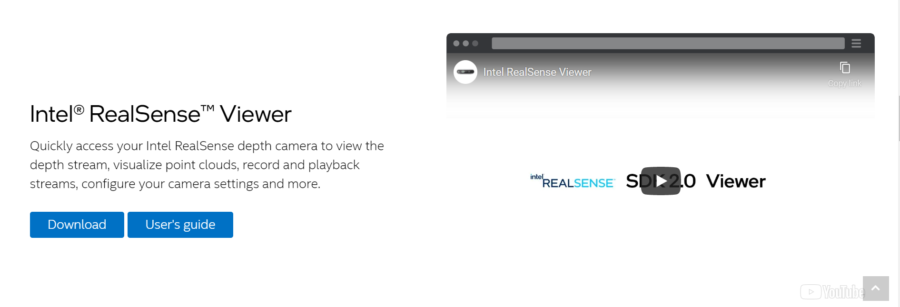
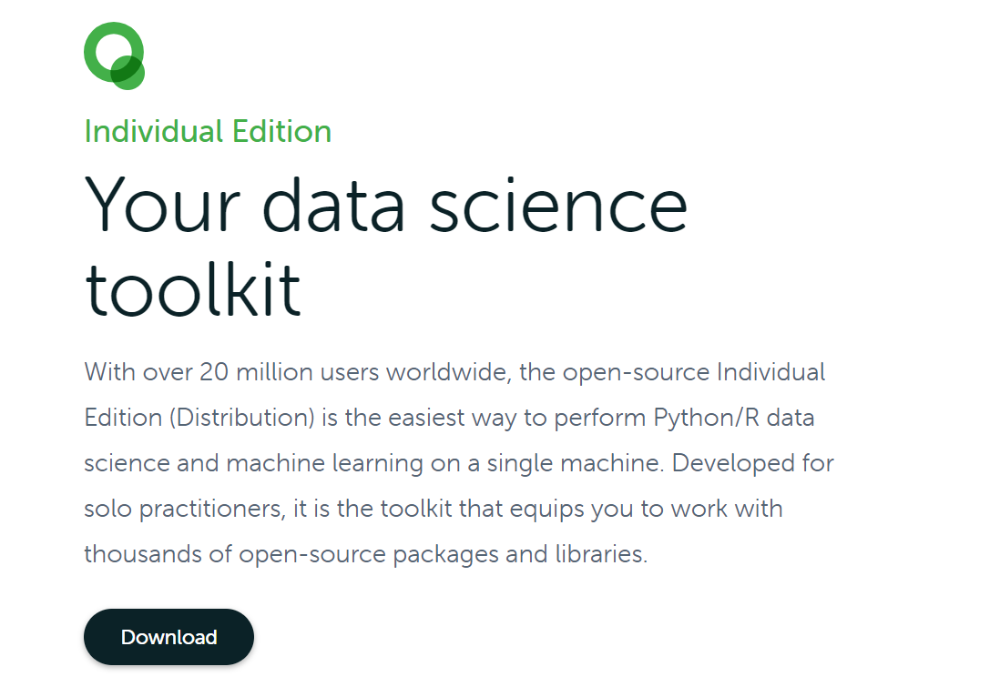
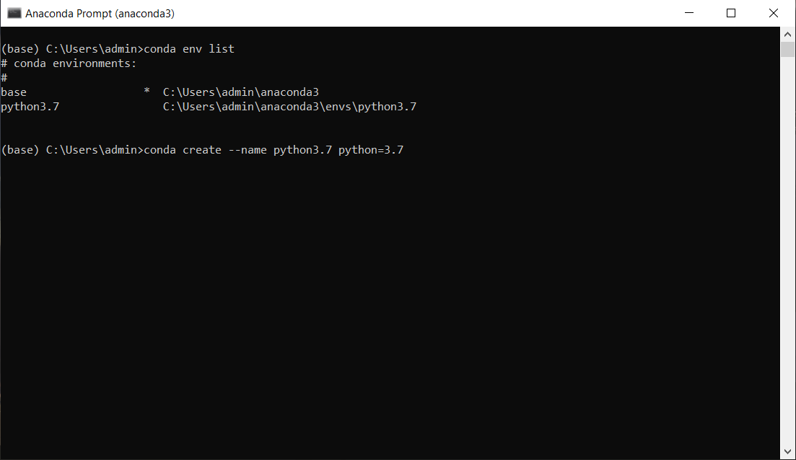
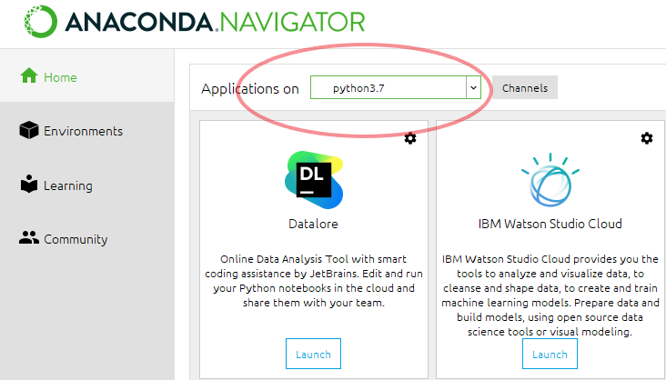

# Using Intel Realsense L515 to Recognize Elevator Floor Hand Gestures
## Goals
* RGB and depth image streaming
* Read and save the RGB and depth video on real-time
* Save numpy array of video in depth

<p align = "center">

</p>

##  How to download Intel Realsense SDK 2.0
* Step 1: Go to **Intel Realsense L515** website.

  [Intel Realsense 515](https://www.intelrealsense.com/lidar-camera-l515/)


* Step 2: Click **Developers** and find **SDK 2.0**, click it.
* Step 3: Scroll down and download **Intel Realsense Viewer**.

* Step 4: Run program, and you have finished downloading.

## Coding environment setting
* Step 1: Download Anaconda (Individual Edition).

  [Download Anaconda](https://www.anaconda.com/products/individual)

* Step 2: Click **Download** and wait for installing.

* Step 3: After installing Anaconda, go to **Anaconda Navigator** and install **Spyder**.
* Step 4: Now, we are going to create an environment that run in Python 3.7.  Open **Anaconda Prompt**.
* Step 5: Enter ```conda env list``` to check you current available environment, then enter ```conda create --name **your name** python=3.7```.

* Step 6: Follow the instructions to finish the installation.  When the installation is finished, you will see this environment in **Anaconda Navigator**.  Install **Spyder** again, you have done installing you coding enviroment.


## Code Source
Some of the codes are based on many authors, including:
* streaming_get_numpy.py is based on https://github.com/IntelRealSense/librealsense/tree/master/wrappers/python/examples
* dataset.py is based on https://github.com/piergiaj/pytorch-i3d and https://github.com/aladdinpersson/Machine-Learning-Collection
* pytorch_i3d.py and train_model.py are based on https://github.com/piergiaj/pytorch-i3d 

## Usage of Codes
* streaming_get_numpy.py: Capturing video from Intel Realsense L515 LiDAR Camera, then convert the datas into RGB/Depth mp4 files and npy files
* convert_grayscale.py: Processing the datas and convert them into trainable datas
* dataset.py: Make dataset (including training set and validation set) from csv files and npy files
* pytorch_i3d.py: The model structure of I3D model (based on "Quo Vadis, Action Recognition? A New Model and the Kinetics Dataset")
* train_model.py: Train the model

## The datasets
mp4 files include RGB and depth colormap video
**The meaning of mp4 filename: modality_subject_floor_trial**
* rgb_1_1_1.mp4
https://user-images.githubusercontent.com/81953068/150064342-a50caac2-5496-41d7-8d09-e024754f5b90.mp4
* depth_1_1_1.mp4
https://user-images.githubusercontent.com/81953068/150063576-ca707b75-0bb0-4bf8-b566-2dac0d640184.mp4
