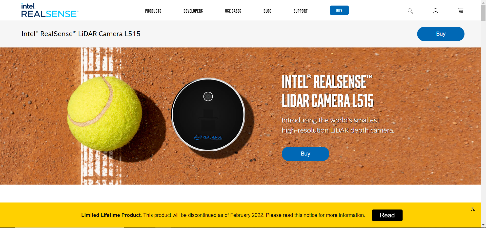

# Using Intel Realsense L515 to Recognize Elevator Floor Hand Gestures
## Goals
* RGB and depth image streaming
* Read and save the RGB and depth video on real-time
* Save numpy array of video in depth

<p align = "center">

</p>

##  How to download Intel Realsense SDK 2.0
* Step 1: Go to **Intel Realsense L515** website.

  [Intel Realsense 515](https://www.intelrealsense.com/lidar-camera-l515/)


* Step 2: Click **Developers** and find **SDK 2.0**, click it.
* Step 3: Scroll down and download **Intel Realsense Viewer**.

* Step 4: Run program, and you have finished downloading.

## Coding environment setting
* Step 1: Download Anaconda (Individual Edition).

  [Download Anaconda](https://www.anaconda.com/products/individual)

* Step 2: Click **Download** and wait for installing.

* Step 3: After installing Anaconda, go to **Anaconda Navigator** and install **Spyder**.
* Step 4: Now, we are going to create an environment that run in Python 3.7.  Open **Anaconda Prompt**.
* Step 5: Enter ```conda env list``` to check you current available environment, then enter ```conda create --name **your name** python=3.7```.

* Step 6: Follow the instructions to finish the installation.  When the installation is finished, you will see this environment in **Anaconda Navigator**.  Install **Spyder** again, you have done installing you coding enviroment.


## Code
